# Biohub Cell Tracking: Reproducible Training and Inference Pipeline

- **Author:** William Duckworth
- **Release status:** pre-publication technical review
- **Reference implementation:** `production/fork-of-fork-of-division-focused.ipynb`
- **Recorded reference score:** `0.957`

This repository documents and implements a modular pipeline for tracking cells
in 3-D fluorescence time series. It is intended for researchers and engineers
who want to inspect, reproduce, validate, or adapt the system rather than treat
the production notebook as an opaque leaderboard artifact.

The release contains the actual Python training and runtime source for the
learned components, the frozen production inference notebook, component-level
training provenance, validation records, artifact contracts, and a 25-page
illustrated architecture reference. Large image volumes, graph banks,
intermediate caches, and model checkpoints remain external because of their
size and data-access requirements.

## Technical architecture

The primary system description is the illustrated
[`Biohub Production .957 - Full Technical Architecture`](docs/biohub_production_957_full_technical_architecture.pdf).
It explains the end-to-end inference order, graph invariants, every helper,
training populations, artifact packages, validation lineage, failure handling,
and the relationship between learned evidence and deterministic graph edits.

At a high level, the production flow is:

```mermaid
flowchart LR
    A[3-D fluorescence movies] --> B[P1/P2 detection and association evidence]
    B --> C[Fused candidate population]
    C --> D[ILP base graph]
    D --> E[Motion relinking and gap repair]
    E --> F[Wider-geometry division proposals]
    F --> G[Multi-UniGRAFT division and cardinality]
    G --> H[Ownership arbitration]
    H --> I[EdgeGRAFT parent repair]
    I --> J[CandidateGRAFT continuation recovery]
    J --> K[Fragment, node-budget, and trajectory cleanup]
    K --> L[Topology validation and atomic output]
```



This order is part of the model contract. Learned helpers are calibrated on
specific graph populations and should not be moved to a different serving
position without rebuilding their evidence and validating the complete graph.

## What is included

- Executable `.py` training source for P1/P2, Model C, source cardinality,
  ownership, EdgeGRAFT, CandidateGRAFT, Motion Corrector, and DeepCenter.
- UniGRAFT's learned cardinality components and deterministic geometry,
  transaction, merge, and topology-safety logic.
- Packaging, cache construction, replay, inspection, and validation utilities.
- The exact production inference notebook retained for the reference release.
- Training-graph identity, feature contracts, grouped split records, retained
  metrics, limitations, and artifact checksums.
- An experiment registry that distinguishes completed evidence from proposals.

## What is not included

- Raw Biohub image volumes or labeled GEFF files.
- Large graph banks, proposal populations, or generated feature caches.
- Model checkpoints distributed through external artifact stores.
- Competition credentials, private data, or machine-specific paths.

Dataset identifiers and expected artifact layouts are retained so that an
authorized researcher can reconstruct the environment without relying on the
original workstation.

## Start here

1. Read the [full technical architecture](docs/biohub_production_957_full_technical_architecture.pdf).
2. Review [`TRAINING_AND_GRAPH_PROVENANCE.md`](TRAINING_AND_GRAPH_PROVENANCE.md)
   to identify the exact image, graph, proposal, and feature population used by
   each component.
3. Follow [`docs/TRAINING_GUIDE.md`](docs/TRAINING_GUIDE.md) for the canonical
   training entry points and command templates.
4. Prepare external inputs according to [`docs/DATA_LAYOUT.md`](docs/DATA_LAYOUT.md).
5. Read [`VALIDATION.md`](VALIDATION.md) and
   [`docs/REPRODUCIBILITY_NOTES.md`](docs/REPRODUCIBILITY_NOTES.md) before
   interpreting metrics or changing detectors.
6. Run `python tools/verify_repository.py` before training or publishing a
   modified release.

## Component map

| Component | Scientific/technical role | Canonical training entry point |
|---|---|---|
| P1/P2 | 3-D cell-center detection and adjacent-frame association | `helpers/01_p1_p2_base/shared_repo/scripts/train_unet_transformer.py` |
| Model C | Independent image/association evidence and division-pair scoring | `helpers/02_model_c/train_division_pair_model.py` |
| Model C + V2 decoder | Combines wider geometry with Model C evidence | `helpers/02_model_c/train_model_c_v2_event_decoder.py` |
| UniGRAFT source cardinality | Selects CONTINUE versus DIVIDE options per source | `helpers/03_source_cardinality/train_source_cardinality_head.py` |
| Independent P1/P2 UniGRAFT branch | Supplies complementary division evidence without Model C | `helpers/04_unigraft_p1p2/train_p1p2_only_cardinality_head.py` |
| Full-population ownership | Arbitrates mutually exclusive graph transactions | `helpers/06_full_population_ownership/score_and_fit_ownership_oof.py` |
| EdgeGRAFT | Ranks alternate parents and gates atomic continuation repairs | `helpers/07_edgegraft/training/train_edgegraft_current_ranker_v3.py` and `train_edgegraft_v3_metric_transaction_gate.py` |
| CandidateGRAFT | Adds high-confidence one-frame continuation edges | `helpers/08_candidategraft/training/train_candidategraft_direct_v1.py` |
| Motion Corrector | Learns a bounded residual for geometric assignment cost | `helpers/09_motion_corrector/TRAINING_V1/train_motion_cost_corrector.py` |
| DeepCenter | Learns 3-D center-likelihood confirmation | `helpers/10_deepcenter/train_full_frame_center_detector.py` |

UniGRAFT is not a single neural network. It is a coordinated division system:
wider geometry proposes daughter pairs; Model C and native P1/P2 evidence score
them; source-cardinality heads select continuation or division; independent
branches contribute complementary events; and atomic merge rules enforce one
parent per node and no more than two children per source.

## Reproduction workflow

### 1. Verify the source release

```bash
python tools/verify_repository.py
```

The verifier checks required files, Python syntax, JSON and notebook parsing,
generated bytecode, and machine-specific path leakage. `SHA256SUMS.csv` records
the content hashes for the release files.

### 2. Prepare data and artifacts

Create the repository-relative `data/`, `external/`, and `artifacts/`
directories described in [`docs/DATA_LAYOUT.md`](docs/DATA_LAYOUT.md). Obtain
the source movies, labels, graph populations, and checkpoints under their
applicable access and redistribution terms.

### 3. Reproduce one component at a time

Use the command templates in [`docs/TRAINING_GUIDE.md`](docs/TRAINING_GUIDE.md).
Do not replace unknown or unannotated candidates with negative supervision.
Preserve complete-movie grouping for training, threshold selection, and held
evaluation.

### 4. Validate the full serving graph

Component metrics are not substitutes for an end-to-end replay. Rebuild the
component at its documented serving position, freeze thresholds using grouped
out-of-fold predictions, evaluate untouched movies once, and validate graph
topology after every atomic transaction.

## Validation principles

- Split by complete movie, never by individual candidate rows from the same
  movie.
- Generate grouped out-of-fold predictions before selecting thresholds.
- Treat unannotated candidates as unknown rather than biological negatives.
- Keep held movies untouched until all model and threshold choices are frozen.
- Report training, grouped OOF, held-movie, practice-movie, exact-replay, and
  hidden measurements as distinct quantities.
- Require every final edge endpoint to exist, time to advance by one frame,
  in-degree to remain at most one, and out-degree to remain at most two.

## Repository layout

```text
.
|-- helpers/                         training, packaging, and runtime source
|   |-- 01_p1_p2_base/
|   |-- 02_model_c/
|   |-- 03_source_cardinality/
|   |-- 04_unigraft_p1p2/
|   |-- 05_live_v2/
|   |-- 06_full_population_ownership/
|   |-- 07_edgegraft/
|   |-- 08_candidategraft/
|   |-- 09_motion_corrector/
|   `-- 10_deepcenter/
|-- production/                      frozen reference inference notebook
|-- docs/                            architecture, experiments, and guides
|-- tools/                           source-release integrity checks
|-- TRAINING_AND_GRAPH_PROVENANCE.md
`-- VALIDATION.md
```

## Portability and historical names

All active documentation and canonical command templates use
repository-relative paths. Historical filenames and artifact identifiers are
preserved when renaming would break imports, invalidate provenance, or make a
saved artifact impossible to trace. A historical filename is not a claim that
its original experimental configuration remains the current production parent.

## Repository history

This branch is based on the project's `main` branch and preserves its earlier
notebooks, scripts, and research documentation. See
[`docs/REPOSITORY_HISTORY.md`](docs/REPOSITORY_HISTORY.md) for the distinction
between retained development material and the `.957` reproducibility release.

## Citation

Citation metadata is provided in [`CITATION.cff`](CITATION.cff). The release is
hosted in the
[`Biohub---Cell-Tracking-During-Development`](https://github.com/Antonoof/Biohub---Cell-Tracking-During-Development)
repository. Add an archival DOI to the citation metadata if a versioned release
is deposited with Zenodo or a comparable archive.

## License and data access

Original contributions by William Duckworth are released under the
[Apache License 2.0](LICENSE). Redistribution must preserve the applicable
license and [`NOTICE`](NOTICE) information. Retained upstream source,
competition material, datasets, and model artifacts remain subject to their
own terms; see [`THIRD_PARTY_NOTICES.md`](THIRD_PARTY_NOTICES.md). Data and model
access may be governed separately from the source-code license.
