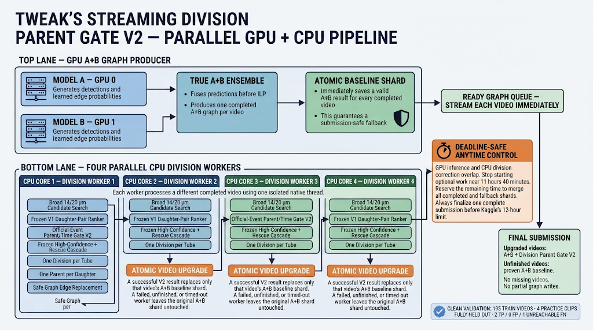
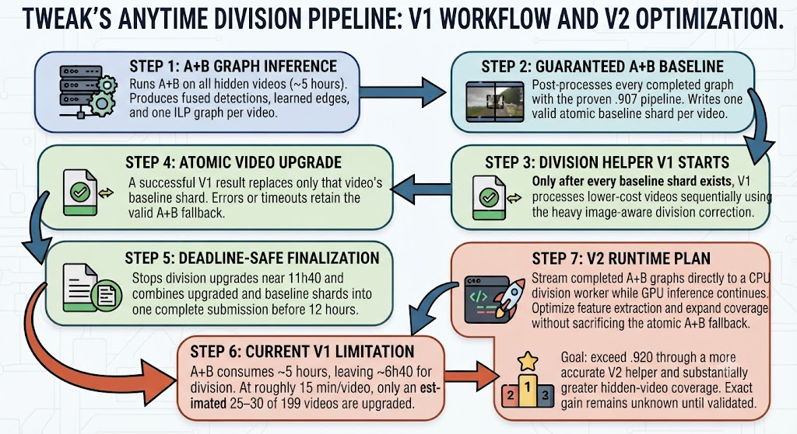

# Learned Division Correction: V1 Result, Official-Event V2, and Streaming Deployment

Last updated: 2026-07-18

## Executive summary

The stable A+B tracking ensemble scored `0.907` on Kaggle but had an extremely
weak division term. On the 199-video local audit, the legacy geometric division
rule produced only 6 true positives, 315 false positives, and 145 false
negatives (`division_jaccard = 0.01288`). The detector was not the central
problem: the broad 14/20 um candidate generator could recover 142 of 151
annotated divisions under a GT-guided oracle.

V1 replaced the legacy division rule with two learned gradient-boosted models:
one model ranks daughter pairs and a second model decides whether a parent
should divide. The full image-aware feature extractor is CPU-heavy, so V1 was
deployed as a submission-safe anytime refinement:

1. Finish and atomically save A+B output for every hidden sample.
2. Upgrade samples one at a time with the learned division correction.
3. Stop division work at approximately 11 h 40 min.
4. Preserve A+B for every unfinished or failed sample.
5. Assemble the complete submission before Kaggle's 12-hour limit.

This raised the Kaggle score from `0.907` to `0.920` (`+0.013`) and reached
fifth place at the time of submission. Hidden execution details are not
exposed, so V1 coverage is estimated at approximately 25-30 of 199 samples,
not measured. The estimate accounts for the approximately five-hour A+B pass,
the measured per-sample division runtime, and the 12-hour completion time.

The result proved that learned division correction transfers to unseen data.
After several unsuccessful V2.1/localizer experiments, a forensic audit found
that the original training cache did not encode the official division event
criterion exactly. That cache was quarantined and rebuilt from scratch.

The resulting **Official-Event Parent Gate V2** keeps V1's strong daughter-pair
ranker but replaces the parent/time gate. It was trained on 195 videos while
the four practice clips were excluded from every fit and threshold decision.
Exact held-four graph replay reached 2 TP, 0 FP, and 1 unreachable FN
(`division_jaccard = 0.6667`) with a combined local proxy of `0.99734`.
The V2 artifact and four-worker streaming notebook subsequently scored
`0.921` on Kaggle. This exceeded both the stable `0.907` A+B baseline and the
V1 division submission's `0.920`, providing a second independent hidden-test
confirmation that the learned division path transfers. The measured V2 gain
over V1 is small (`+0.001`), so V1 remains an important frozen reproduction
reference while V2 is the current best validated division helper.

## Current streaming V2 architecture

Models A and B run concurrently on GPU 0 and GPU 1. As soon as one fused A+B
graph is complete, the notebook atomically writes its valid baseline shard and
places the graph in a ready queue. Four isolated, single-threaded CPU workers
process different completed videos while GPU inference continues. A successful
V2 result replaces only its own baseline shard; failure, timeout, or unfinished
work retains the valid A+B result. Optional division work stops near 11 h 40 min
so all upgraded and fallback shards can be merged before Kaggle's 12-hour limit.

## Historical V1 anytime workflow and V2 runtime plan

V1 guarantees a valid A+B baseline for every hidden video before beginning
the expensive division upgrades. V2 preserves that atomic fallback while
streaming completed A+B graphs to CPU division workers, allowing GPU inference
and division refinement to overlap.

## Stable baseline

The fallback is the stable `0.907` pipeline:

- True A+B logit ensemble.
- One shared detection graph and one ILP.
- Learned motion-cost correction.
- Registration-aware motion relinking.
- Gap and conservative gap2 recovery.
- Line-fit smoothing.
- Adaptive short-track filtering.
- Legacy safe-division rule when the learned division helper is disabled.

The anytime notebook never leaves a sample without this baseline output.

## Why division became the primary target

The full 199-video audit of the `0.907` pipeline reported:

| Metric | Value |
|---|---:|
| Edge Jaccard | 0.90367 |
| Adjusted edge Jaccard | 0.90104 |
| Node recall | 0.97791 |
| Division TP | 6 |
| Division FP | 315 |
| Division FN | 145 |
| Division Jaccard | 0.01288 |
| Combined local score | 0.90233 |

The candidate-gate audit isolated the failure:

| Candidate generator | Recoverable GT divisions | Recall |
|---|---:|---:|
| Original exact rule | 10 / 151 | 6.6% |
| Permit already-claimed children | 13 / 151 | 8.6% |
| Wider second-child search | 56 / 151 | 37.1% |
| Permit zero-outdegree parents | 57 / 151 | 37.7% |
| Rebuild complete pair at 10/14 um | 109 / 151 | 72.2% |
| Rebuild complete pair at 14/20 um | 142 / 151 | 94.0% |

Detected nodes were sufficient for 146 of 151 events (96.7% node coverage).
The missing capability was selecting the correct parent and complete daughter
pair, then safely replacing conflicting graph edges.

The `94%` number is an oracle candidate-recall ceiling. It is not an expected
division Jaccard or leaderboard score.

## V1 model and training

### Supervision

V1 was trained from the sparse, GT-matched division cache generated from all
199 training videos:

| Bank | Rows | Positive rows | Features |
|---|---:|---:|---:|
| Parent/source candidates | 127,398 | 436 | 41 |
| Daughter-pair candidates | 1,095,856 | 479 | 78 |
| Unique annotated division events | 151 | - | - |

Multiple positive candidate rows can correspond to one annotated event, so the
positive-row counts must not be interpreted as unique divisions.

The feature cache is sparse-GT matched. It does **not** contain the complete
unannotated cell population. Full-population feature extraction is a separate,
expensive operation.

### Candidate geometry

- High-confidence core: both parent-to-daughter distances no greater than
  10 um and daughter separation no greater than 14 um.
- Rescue tier: broad 14/20 um candidate generation.
- Candidate pairs are ranked jointly rather than adding only one unclaimed
  child to an existing edge.

### Features

The 41 parent features include:

- Time and normalized position.
- Z-boundary position.
- Incoming/outgoing degree, distance, and learned edge probability.
- Velocity, acceleration, and registration-shift magnitude.
- Local cell density and child counts.
- Previous/current/next-frame intensity and morphology statistics.
- Temporal changes in intensity and elongation.

The 78 pair features contain the parent features plus:

- Both parent-to-child distances and their asymmetry.
- Sister separation, midpoint conservation, and daughter angle.
- Existing-graph claims and connected-component relationships.
- Core/rescue geometry flags.
- Both daughter intensity and morphology statistics.
- Parent/daughter intensity balance, midpoint intensity, and line-valley
  statistics.

### Models

V1 uses two `HistGradientBoostingClassifier` models.

Pair model:

- Input: 78 pair features.
- `max_iter = 300`
- `learning_rate = 0.06`
- `max_leaf_nodes = 63`
- `l2_regularization = 1.0`
- Balanced class weights.

Source model:

- Input: 123 dimensions.
- Construction: 41 parent features + 78 features from the highest-scoring
  daughter pair + maximum pair score + mean pair score + count above 0.5 +
  `log1p(number_of_pairs)`.
- `max_iter = 500`
- `learning_rate = 0.05`
- `max_leaf_nodes = 63`
- `l2_regularization = 1.0`
- Balanced class weights.

Preprocessing is `nan_to_num(..., 0.0)` with no feature scaling. One parent is
retained per linked track/tube by maximum source probability.

### Deployment settings

| Setting | V1 value |
|---|---:|
| Source threshold | 0.65 |
| Rescue delta | 0.15 |
| Edge-steal delta | 0.25 |
| Legacy safe divisions | Replaced by GBM on upgraded samples |

## V1 validation and Kaggle result

### Honest grouped-video proxy

The original V1 deployment specification recorded:

| Split | Division Jaccard proxy |
|---|---:|
| All videos | 0.530 |
| 44b6 | 0.828 |
| 6bba | 0.474 |

This proxy was computed on sparse, GT-matched cells. The official graph replay
remains the required arbiter because it enforces daughter-component matching
and graph conflicts.

### Four-clip official graph replay

At threshold `0.65` with complete-pair replacement:

| Metric | Value |
|---|---:|
| Division TP / FP / FN | 1 / 2 / 2 |
| Division Jaccard | 0.200 |
| Adjusted edge Jaccard | 0.93194 |
| Combined replay score | 0.95194 |

The Kaggle-formatted four-clip notebook run produced a comparable combined
local score of approximately `0.95065`, about `+0.02098` above its exact
`0.92967` fallback result.

### Hidden Kaggle execution

| Submission | Score |
|---|---:|
| Stable A+B baseline | 0.907 |
| A+B + anytime learned division V1 | **0.920** |
| A+B + optimized four-worker V1 | **0.920** |
| A+B + Official-Event Parent Gate V2 | **0.921** |
| V1 improvement over baseline | **+0.013** |
| V2 improvement over baseline | **+0.014** |
| V2 improvement over V1 | **+0.001** |

V1 established that learned division correction transfers beyond the four
practice clips. The scheduling-only four-worker optimization reproduced the
same `0.920`, confirming that parallel execution preserved V1 behavior. V2
then improved the hidden score to `0.921`, validating the clean official-event
parent gate while showing that its incremental advantage over V1 is modest.

## Anytime runtime design

The full image-aware division correction took over one hour for the four
practice clips. Applying it to all 199 hidden samples sequentially could not
finish inside Kaggle's 12-hour limit.

The anytime notebook therefore uses two passes.

### Pass 1: guaranteed baseline

- Complete A+B inference and post-processing for every sample.
- Write one CSV shard per sample.
- Use a temporary file followed by atomic replacement.
- At the end of this pass, every sample has valid `0.907`-class output.

### Pass 2: opportunistic upgrades

- Process lower-cost samples first.
- Reopen the cached pre-ILP graph.
- Run the full image-aware division feature extractor and GBM correction.
- Atomically replace a sample shard only after the complete upgrade succeeds.
- Retain baseline output after any exception.

### Deadline behavior

- The wall clock begins in the first code cell.
- Full-GBM processing deadline: approximately 11 h 40 min.
- Final-submission reserve: 10 min.
- Target completion: 11 h 50 min.
- Remaining Kaggle safety margin: approximately 10 min.
- A real `SIGALRM` interrupts an active upgrade at the processing deadline.
- An interrupted shard never replaces its valid baseline shard.

The hidden scorer does not expose per-sample logs or artifacts. The estimated
25-30 upgraded samples must remain labeled as an estimate until a future
execution environment exposes the actual run manifest.

## What did not work

- Removing image features made feature extraction much faster but materially
  reduced official four-clip improvement.
- A geometry-only deployment gained roughly `+0.009` locally versus roughly
  `+0.021` for the full image-aware deployment.
- Geometry alone could not provide a safe division veto at near-100% recall.
- Earlier parent gates repeatedly failed through threshold instability,
  false-positive flooding, or train/serve mismatch.
- Lifetime-maximum aggregation introduced a length-biased extreme-value error:
  long tracks won because they had more opportunities for a noisy maximum.

## V2 accuracy work

> Historical note: the rich-input, pseudo-label, and V2.1 experiments below
> explain the path to the forensic audit. They are not the current deployment.
> The promoted model is the later Official-Event Parent Gate V2 described near
> the end of this document.

V2 keeps the same 41/78 feature schemas but improves source discrimination.

### Rich source input

V2 source input has 206 dimensions:

- Parent/source features: 41.
- Highest-scoring pair features: 78.
- Second-highest pair features: 78.
- Nine score-distribution aggregates:
  - maximum pair score;
  - mean of top two;
  - mean of top three;
  - mean and standard deviation over all pairs;
  - counts above 0.3, 0.5, and 0.7;
  - `log1p(number_of_pairs)`.

### Hard-negative mining result

All results below are two-seed, grouped-by-video validation:

| Configuration | Division Jaccard | TP | FP | FN |
|---|---:|---:|---:|---:|
| Baseline V2 experiment | 0.391 | 90 | 88 | 52 |
| Rich aggregation only | 0.383 | - | - | - |
| Rich aggregation + hard-negative mining | **0.445** | 89 | 58 | 53 |

Per embryo for the current best V2 candidate:

| Embryo | Division Jaccard |
|---|---:|
| 44b6 | 0.759 |
| 6bba | 0.392 |

Hard-negative mining cut false positives from 88 to 58 while retaining nearly
all true positives. The remaining limitation is recall, especially on 6bba.

## V2 pseudo-labeling plan

This plan was explored but was not promoted. Unknown sparse-GT rows remain
excluded from negative supervision in the current model.

The current detector sees all cells, but sparse GT labels only a small subset.
The next supervision multiplier is same-domain, cross-fitted pseudo-labeling.

For each grouped-video fold:

1. Train the teacher only on the fold's training videos.
2. Score the full unannotated candidate population of training videos.
3. Apply one-candidate-per-tube NMS.
4. Exclude all GT-annotated tubes from the pseudo-label pool.
5. Initially retain only source scores at or above `0.95`.
6. Require reliable daughter-pair agreement before assigning a pair label.
7. Train the student with GT sample weight `1.0` and pseudo-positive weight
   `0.3`.
8. Evaluate exclusively on real GT from held-out videos.
9. Promote only if held-out division Jaccard exceeds `0.445` without a
   meaningful 6bba regression.
10. Lower the threshold toward `0.90` only after held-out improvement.

The first pseudo-label prototype on four clips was encouraging but small:

| Threshold | Harvested | Checkable div / continuation | Observed precision | New unannotated |
|---|---:|---:|---:|---:|
| 0.70 | 294 | 6 / 1 | 0.857 | 287 |
| 0.90 | 162 | 5 / 1 | 0.833 | 156 |
| 0.95 | 48 | 4 / 0 | 1.000 | 44 |

Only seven harvested cells were checkable at the lower thresholds, so these
precision estimates are directional rather than conclusive.

## V2 efficiency roadmap

Accuracy and efficiency are separate promotion gates. The following order
avoids trading away the transfer gain that produced `0.920`.

1. **Validate V2 accuracy first.** Run grouped-video validation and the
   four-practice-clip official graph replay.
2. **Cache full candidate features.** Reuse A+B graphs; do not rerun A+B.
3. **Parallelize by video locally.** The Ryzen 9 5950X has 16 physical cores.
   The pilot uses two extraction workers with eight threads each.
4. **Batch image work on GPU.** The current bottleneck is CPU patch/statistic
   extraction, not gradient-boosting inference. Merely assigning the HGB model
   to CUDA will not help.
5. **Profile feature families.** Remove a feature family only when the official
   graph replay shows no loss, not from an incomparable tabular ablation.
6. **Prioritize by expected gain per second.** The anytime queue should use
   predicted division benefit and measured cost rather than filename order.
7. **Retain atomic fallback.** Every future notebook must complete A+B for all
   samples before optional refinement.
8. **Train on the full runtime population.** Use the resumable 199-video
   transition exporter. Keep annotated divisions and confirmed continuations
   as supervised rows, retain unannotated transitions as unknown, and never
   silently convert sparse-GT unknowns into negatives.

## Promotion checklist

Official-Event V2 status:

- [x] Grouped-video OOF action Jaccard greater than `0.445` (`0.5463`).
- [x] Four practice clips excluded from every fit and threshold decision.
- [x] Four-clip official graph replay exceeds V1 (`0.6667` versus `0.0000`
  division Jaccard under the comparable replay).
- [x] Adjusted edge Jaccard does not regress materially (`0.930673`).
- [x] Daughter-component validity and one-parent-per-child constraints pass.
- [x] Feature schema is aligned by name, not column position.
- [x] Packaged runtime reproduces cached selection counts exactly.
- [x] Four-worker streaming, deadline guard, and atomic A+B fallback remain enabled.
- [x] Kaggle artifact paths and offline dependencies are documented.
- [x] Complete the first hidden Kaggle run: V2 scored `0.921`, compared with
  V1's `0.920` and the stable A+B baseline's `0.907`.
- [x] Confirm normal deadline-safe finalization and a complete submission.
- [ ] Record exact hidden per-video upgrade coverage if a future Kaggle run
  exposes it; the scored run did not reveal sample-level hidden diagnostics.

## Reproducibility paths

These paths document the development machine. Model weights and competition
data are intentionally excluded from Git.

### Windows/Kaggle workspace

- V1 full notebook: `historical\true-ensemble-division-gbm.ipynb`
- V1 anytime notebook: `historical\true-ensemble-division-gbm-anytime.ipynb`
- V1 Kaggle artifact staging: `historical\biohub-division-gbm-v1`
- V2 Kaggle artifact staging:
  `historical\biohub-division-parent-gate-v2`
- V2 four-worker streaming notebook:
  `historical\true-ensemble-division-parent-gate-v2-streaming-4worker-anytime.ipynb`
- V2 scored submission notebook:
  `historical\division-gbm-w-updated-model.ipynb`

### WSL development workspace

- V1 deployment: `data/division_gbm_deploy_v1`
- Promoted V2 deployment:
  `data/division_parent_gate_v2_deploy`
- Clean official-event cache:
  `data/division_official_event_cache_v2.npz`
- Clean V2 compact leave-four-out model:
  `data/division_parent_gate_official_v2_compact_leave4out`
- Faulty V1 label cache quarantine:
  `data/frozen_v1_repro/faulty_label_cache_20260716`
- Exact V2 held-four graph replay:
  `data/division_parent_gate_v2_official_4clips`
- Full 199-video A+B proposals:
  `data/ab_proposals_export/biohub_ab_proposals`
- Stable `0.907` audit: `data/audit_907_v1`
- Pre-safe graphs:
  `data/division_candidate_audit_v1/pre_safe_graphs`
- Four-clip full candidate features:
  `data/division_gbm_replay_4clips_v1/candidates_full`
- Runtime implementation:
  `external/bio_track_repo/scripts/division_gbm_runtime.py`
- Replay/scoring wrapper:
  `external/bio_track_repo/scripts/replay_division_gbm_model.py`
- Full-population transition exporter:
  `external/bio_track_repo/scripts/export_division_v3_full_population.py`
- Resumable 199-video exporter launcher:
  `historical/export_division_v3_full_population.sh`
- Full-population transition cache:
  `data/division_v3_full_population_cache`

### Superseded progressive prototypes

The following launchers were used during early 20- and 60-video pseudo-label
experiments. They are retained only for historical reproducibility and are not
part of the current V2 workflow:

- `historical/run_pseudo_candidates_20_parallel.sh`
- `historical/run_pseudo_candidates_60.sh`
- `data/division_pseudo_candidates_60_v1/candidates_full`

## Current conclusion

V1 remains the frozen, reproducible `0.920` reference. Official-Event V2 is
the current best validated division helper at `0.921`. It cleared the local
promotion gates—clean labels, grouped OOF, four completely held-out practice
clips, exact graph replay, and packaged runtime parity—and then produced a
real `+0.001` hidden improvement over V1.

Preserve both artifacts. V1 is the control and recovery path; V2 is the active
division helper. Further division work must beat V2 using held-video official
graph evaluation before hidden submission. Association, detection, and other
non-division experiments belong in separate experiment logs so this document
remains an auditable division-only history.

## Full-population V2.1 audit (2026-07-16)

The resumable exporter completed all 199 videos and produced a structurally
verified full-population transition cache:

| Item | Count |
|---|---:|
| Runtime transition rows | 4,995,373 |
| Annotated division frames | 149 |
| Confirmed continuation frames | 94,624 |
| Unannotated/unknown frames | 4,900,600 |
| Cache size | 6,139,644,553 bytes |

The sparse-safe V2.1 gate used all 282 runtime features, whole-video folds,
confirmed continuations plus non-division frames from annotated dividing tubes
as negatives, and a single global threshold of `0.8`. Its held-fold OOF result
was:

| Split | Division Jaccard | TP | FP | FN |
|---|---:|---:|---:|---:|
| All | 0.2408 | 72 | 150 | 77 |
| 6bba | 0.2460 | 62 | 128 | 62 |
| 44b6 | 0.2128 | 10 | 22 | 15 |

V2.1 reduced the post-tube-NMS V3 flood from 145,309 to 8,374 selected
tubes. However, the exact four-practice-clip replay initially used the final
all-data model, which had trained on those four clips. That replay was
in-sample and is retained only as a deployment diagnostic.

The corrected replay injected each clip's saved held-fold OOF scores into the
exact graph transaction. Both conservative and guarded-steal policies failed
the division gate:

| Policy | Adjusted edge Jaccard | Division TP / FP / FN | Division Jaccard | Combined local score |
|---|---:|---:|---:|---:|
| Replace, no stealing | 0.932537 | 0 / 1 / 3 | 0.000 | 0.932537 |
| Replace, guarded stealing | 0.932539 | 0 / 1 / 3 | 0.000 | 0.932539 |

The full-282 Stage A listwise temporal ranker was also tested with whole-video
folds. It did not beat V2.1 localization:

| Embryo | Stage A top-1 | V2.1 top-1 |
|---|---:|---:|
| 6bba | 0.500 | 0.597 |
| 44b6 | 0.520 | 0.560 |

The subsequent Stage B prototype is invalid and must not be deployed: it
marked an entire tube negative whenever that sparsely annotated tube contained
a confirmed continuation. The same tube can contain an unannotated division at
another frame, so this violates sparse-label safety.

### V2.1 decision

This was the correct decision at the time and is retained as historical
evidence. It was later superseded by the clean Official-Event V2 result.

- Preserve V2.1 and Stage A as diagnostic artifacts; do not package them.
- Do not use the invalid Stage B artifact.
- Keep V1 as the frozen `0.920` reproduction path.
- Use only Official-Event Parent Gate V2 for the successor hidden-test
  experiment. That experiment subsequently scored `0.921`.

## Four-process streaming scheduler (2026-07-16)

The approved V1 helper is now available in a scheduling-only four-process
notebook:

- Builder: `scripts/build_streaming_4worker_notebook.py`
- Notebook: `historical\true-ensemble-division-gbm-crossfit-streaming-4worker-anytime.ipynb`

The two-GPU A+B producer continues to emit atomic ready markers. The parent
creates a complete A+B baseline shard immediately, then dispatches that video
to one of four isolated CPU processes. Each process is capped to one native
BLAS/OpenMP thread. A successful V1 result atomically replaces only its own
baseline shard; worker failure, timeout, or the 11h40 processing cutoff leaves
the valid A+B shard untouched.

The original scheduler experiment changed scheduling only. The promoted V2
notebook retains the same four-process/atomic-fallback scheduler but replaces
the V1 selector artifact and its threshold policy with the clean V2 gate.

Runtime controls:

- `BIOHUB_DIVISION_WORKERS=4`
- `BIOHUB_DIVISION_WORKERS_WHILE_PREDICTING=4`
- `BIOHUB_STREAMING_WARMUP_GRAPHS=1`

At the measured rough cost of 15 minutes per video, four workers can complete
about 187 upgrades before the 11h40 processing cutoff. Covering all 199 needs
an average at or below about 14.1 minutes per video, so four-way scheduling is
necessary but may still require a small exact feature-extraction speedup.

## Official-Event Parent Gate V2 (hidden Kaggle validated at 0.921)

### Why the earlier training path was rejected

The forensic audit showed that the original V1 cache used broad lineage-oracle
labels that did not always match the official division component criterion.
Two apparently recoverable practice events were also being proposed at an
invalid `t+2` transition. Relaxing graph conflict rules could insert those
forks, but the official metric still rejected them. Training or validating on
those labels therefore overstated what the runtime could score.

The active faulty cache was removed and quarantined before regeneration. The
new cache records `v1_cache_used = false` and derives every positive from an
official-valid complete parent/daughter action.

### Clean cache integrity

| Item | Count |
|---|---:|
| Videos | 199 |
| Official division events | 151 |
| Candidate sources | 127,432 |
| Official-positive sources | 345 |
| Candidate daughter pairs | 1,422,655 |
| Official-positive pairs | 789 |
| Recoverable events | 141 / 151 |

Ten events are unreachable under the clean candidate graph. The four practice
clips were present only for final evaluation; they were excluded from all
training folds, final fitting, and selection-policy tuning.

### Final factorization

The joint 119-feature action model damaged the already-strong daughter-pair
ranking and failed all three held practice divisions. The final V2 therefore
uses a cleaner division of responsibility:

1. Freeze V1's 78-feature daughter-pair ranker.
2. Select the V1-best complete daughter pair for each source.
3. Score the source/time action with the new 121-feature official-event gate.
4. Apply a grouped-OOF-frozen high-confidence/rescue cascade.
5. Keep one action per linked tube.
6. Enforce one parent per daughter before graph mutation.

The compact 121-feature gate uses exactly the information retained by the V1
full-population cache: 41 source features, 78 best-pair features, the best-pair
probability, and the original V1 source probability. This enabled an exact
full-population graph replay without regenerating expensive image features.

### Frozen selection policy

Accept a source when either:

- V2 gate score is at least `0.895`; or
- V2 gate score is at least `0.800`, V1 pair probability lies within
  `[0.850, 0.920]`, and V1 source probability is at least `0.9475`.

The rescue band improved grouped OOF action Jaccard from `0.5446` to `0.5463`.
All values were selected on the 195-video grouped OOF predictions. None was
selected by inspecting the four held clips.

### Honest validation

| Validation | Jaccard | TP | FP | FN |
|---|---:|---:|---:|---:|
| 195-video grouped OOF action proxy | 0.5463 | 118 | 68 | 30 |
| Four held clips, exact graph metric | **0.6667** | **2** | **0** | **1** |

Held-four graph totals:

| Metric | Value |
|---|---:|
| Adjusted edge Jaccard | 0.930673 |
| Edge Jaccard | 0.933877 |
| Division Jaccard | 0.666667 |
| Combined local proxy | 0.997340 |

The single FN is the clean-cache-unreachable event. Both reachable divisions
were assigned the correct parent and daughter pair and survived final graph
post-processing. The local `0.99734` proxy is not a promised hidden Kaggle
score; hidden distribution and deadline coverage remain unknown.

### Runtime parity and deliverables

The packaged runtime was independently executed on `6bba_05b6850b` and exactly
matched the cached replay: 6,068 scored sources, 16,578 scored pairs, 12 passing
sources, and 8 final tube winners.

- Kaggle artifact: `historical\biohub-division-parent-gate-v2`
- Artifact archive: `historical\biohub-division-parent-gate-v2.zip`
- Streaming notebook:
  `historical\true-ensemble-division-parent-gate-v2-streaming-4worker-anytime.ipynb`
- Local report:
  `outputs/DIVISION_PARENT_GATE_V2_REPORT.md`

### Hidden Kaggle result

| Reference | Score |
|---|---:|
| Stable A+B baseline | 0.907 |
| Learned division V1 | 0.920 |
| Official-Event Parent Gate V2 | **0.921** |

Status: **hidden Kaggle validated and retained as the active division helper**.
The submission finalized normally and improved V1 by `+0.001`. Exact hidden
per-video upgrade coverage was not exposed, so no coverage count is inferred
from the final score.
