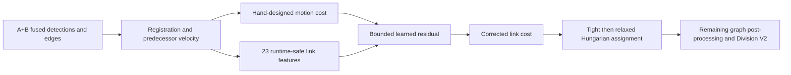

# Biohub Learned Motion-Cost Corrector V1

## Production status

**KEEP — active component of the `.931` production pipeline.**

The learned motion-cost corrector is a lightweight residual model used inside
the sequential Hungarian motion-relinking stage of the A+B tracker. It is not a
cell detector, a complete tracker, or a standalone submission model.

The production checkpoint is distributed through the Kaggle dataset
`biohub-motion-corrector-v1`:

```text
biohub-motion-corrector-v1/motion_corrector_best.pt
```

The `.931` notebook loads it with:

```text
BIOHUB_MOTION_COST_CORRECTOR_ENABLED=1
BIOHUB_MOTION_COST_CORRECTOR_STRENGTH=1.0
```

## Why it exists

The original registration-aware motion relinker used a hand-designed cost
based primarily on registered distance and predecessor velocity. That cost was
stable, but difficult candidate links were not always ordered correctly.

The corrector preserves that deterministic motion model and learns only a
bounded residual adjustment. In effect:

```text
corrected_cost = base_motion_cost - learned_residual
```

The residual is bounded to `[-2, +2]` before the configured strength is
applied. This prevents the small neural model from replacing the physical
motion prior or creating unconstrained link scores.



## Runtime-safe checkpoint

The uploaded artifact is the runtime-safe revision, not the earlier
28-feature experimental checkpoint. Five proposal-cache-only fields were
removed because they are not preserved in submitted GEFF graphs:

- source and target detector probability;
- source and target detector disagreement;
- frozen-frame flag.

The production model uses these 23 features, all available at inference:

1. base cost;
2. raw distance;
3. registered distance;
4. motion-prediction distance;
5. absolute raw `dz`, `dy`, and `dx`;
6. absolute registered `dz`, `dy`, and `dx`;
7. predecessor velocity `z`, `y`, `x`, and magnitude;
8. registration shift `z`, `y`, `x`, and magnitude;
9. source and target local density;
10. source and target normalized z-boundary distance;
11. predecessor-availability flag.

The network is intentionally small:

```text
23 inputs -> Linear(64) -> SiLU -> Dropout(0.05)
          -> Linear(32) -> SiLU -> Linear(1)
```

Total checkpoint model parameters: **3,649**.

## Training method

The corrector was trained on A+B proposal links generated from the Biohub
training set, using the split-1-compatible `190 train / 9 held-video` split.
The candidate generator used:

- registered candidate radius: `9.5 um`;
- predecessor velocity weight: `0.52`;
- tight assignment gate during training: `6.2 um`;
- hard-negative ratio: up to `20:1` per supervised transition;
- optimizer: AdamW, learning rate `2e-3`, weight decay `1e-4`;
- focal-weighted binary cross-entropy;
- batch size: `8192`;
- gradient-norm clipping: `2.0`;
- early stopping on held-video sequential-assignment Jaccard.

Sparse annotations were handled by supervising a candidate only when its
source had an annotated outgoing transition or its target had an annotated
incoming transition. Unannotated candidates were not automatically counted as
false links.

During inference, the current production pipeline uses the subsequently tuned
motion gates (`6.0 / 9.5 um`) and corrector strength `1.0`.

## Validation evidence

### Held-video motion assignment

| Metric | Hand-designed cost | Runtime-safe corrector | Delta |
|---|---:|---:|---:|
| True-positive links | 5,629 | 5,661 | +32 |
| False-positive links | 391 | 355 | -36 |
| False-negative links | 364 | 332 | -32 |
| Precision | 0.93505 | 0.94099 | +0.00594 |
| Recall | 0.93926 | 0.94460 | +0.00534 |
| Jaccard | **0.88174** | **0.89178** | **+0.01004** |

This is a sequential motion-assignment metric on held proposal videos. It is
not the complete competition score.

### Complete four-clip local pipeline

With the corrector integrated into the full A+B graph pipeline:

| Diagnostic | Without learned residual | With learned residual | Delta |
|---|---:|---:|---:|
| Adjusted graph proxy | 0.925424 | 0.927073 | +0.001650 |
| Edge TP | - | - | +1 |
| Edge FP | - | - | -3 |
| Edge FN | - | - | -1 |

These four-clip values are diagnostic and are not guaranteed leaderboard
scores. The standalone learned-motion notebook scored `0.907`, equal after
rounding to its `0.907` leaderboard baseline. The component was retained
because it improved held motion assignment and the complete local graph proxy
without a hidden-score regression, and it remains integrated in the current
`.931` production system.

## Integration references

- Current hidden-validated production notebook:
  [`../notebooks/division-gbm-model-c-combined-primary-hidden.ipynb`](../notebooks/division-gbm-model-c-combined-primary-hidden.ipynb)
- Promoted next candidate:
  [`../notebooks/division-gbm-model-c-v2-arbiter.ipynb`](../notebooks/division-gbm-model-c-v2-arbiter.ipynb)
- External artifact registry:
  [`../models/README.md`](../models/README.md)
- Team experiment registry:
  [`EXPERIMENTS.md`](EXPERIMENTS.md)

The original local training implementation and primary evidence remain at:

```text
external/bio_track_repo/scripts/train_motion_cost_corrector.py
external/bio_track_repo/train_motion_corrector_20260712_172831.log
external/bio_track_repo/weights/motion_cost_corrector_runtime_safe/motion_corrector_best.pt
./outputs/learned_motion_results_20260712/local_gt_eval.csv
```

## Artifact integrity

SHA-256 of the documented runtime-safe checkpoint:

```text
57B2FA4F0585C5915F46C2C99E9B48690B74654EA5652F19577963C474CF2AE5
```

Verified locally against:

```text
external/bio_track_repo/weights/motion_cost_corrector_runtime_safe/motion_corrector_best.pt
```

## Limitations

- The model depends on A+B detections and cannot run independently.
- It improves the ordering of existing motion candidates; it cannot recover a
  cell that the detector never proposed.
- Its held metric is candidate-assignment Jaccard, not the official aggregate
  competition metric.
- Its standalone leaderboard result was neutral after three-decimal rounding.
- It must be loaded by feature name and must use the 23-feature runtime-safe
  schema. The earlier 28-feature checkpoint is not production compatible.
- Competition images and annotations are not included with the model artifact.

## Decision record

The corrector is **not** an abandoned experiment. It is a small, bounded,
non-regressing helper carried forward into the `.921` system. Keep the
checkpoint, schema, strength, and integrity hash frozen unless a replacement
beats the full graph pipeline under the same validation protocol.
